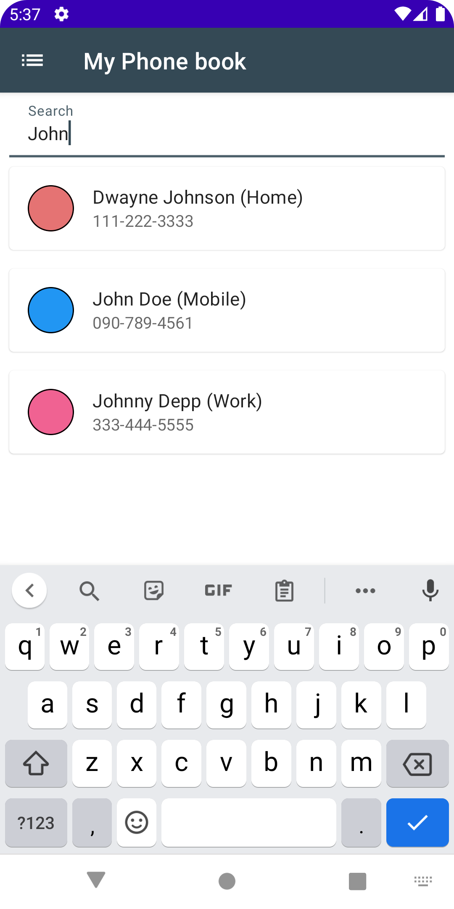

# cn333as5
Application Phone Book จะมีการทำงานดังนี้
1. สามารถที่จะเก็บบันทึกเบอร์โทรศัพท์และรายละเอียดได้
2. สามารถเพิ่มข้อมูลได้
3. สามารถแก้ไขข้อมูลที่บันทึกอยู่ได้
4. มีการระบุหมวดหมู่ว่าเบอร์โทรนี้เป็นเบอร์ประเภทไหน เช่น Home Work เป็นต้น
5. ในการแสดงข้อมูลนั้นจะแสดงเรียงตามตัวอักษร
6. มีฟังก์ชั่นสำหรับการ search หาเบอร์โทรจาก ชื่อ หรือ หมวดหมู่
7. สามารถลบข้อมูลและกู้ข้อมูลกลับมาได้

## interface

  
  
  
  
  
  
  
  

## Demo Link
[CN333 - as5 Phone Book Application Demo | Raned Chuphueak](https://youtu.be/obeq-LSxq5o)

## Contributor
รเณศ ชูเผือก 6210612864
